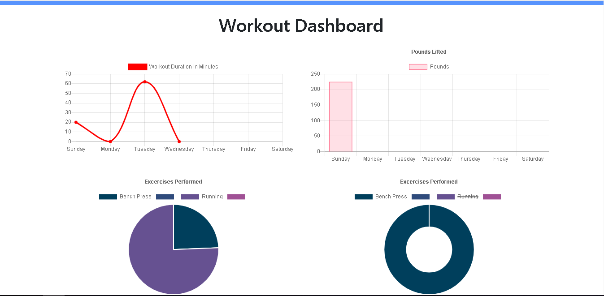

# Workout-Tracker
  Repo by RyanJMS
  
  
  Live Site via Github Pages -> https://polar-badlands-11589.herokuapp.com/
  
  
# Demonstration

# Table of Contents

1. [Description](#Description)
2. [Installation](#Installation)
3. [Usage](#Usage)
4. [License](#License)
5. [Contributing](#Contributing)

## Description

This is workout tracker built using nodeJS, mongoDB, and express. The front-end for this assignment was provided by BCS.

The app allows users to add new resistance or cardio exercises, and track reps/sets/weight/duration, and plots the information to the stats page to allow the user to view progress over time.

## Installation

Clone the repository to your local drive, and run npm install. Then npm start, and you're good to go!

## Usage

Used to track workouts, and graph progress over time. You can add resistance or cardio exercises, as well as specifiy weight/reps/sets/duration for each.

## License

MIT

## Contributing

RyanJMS

